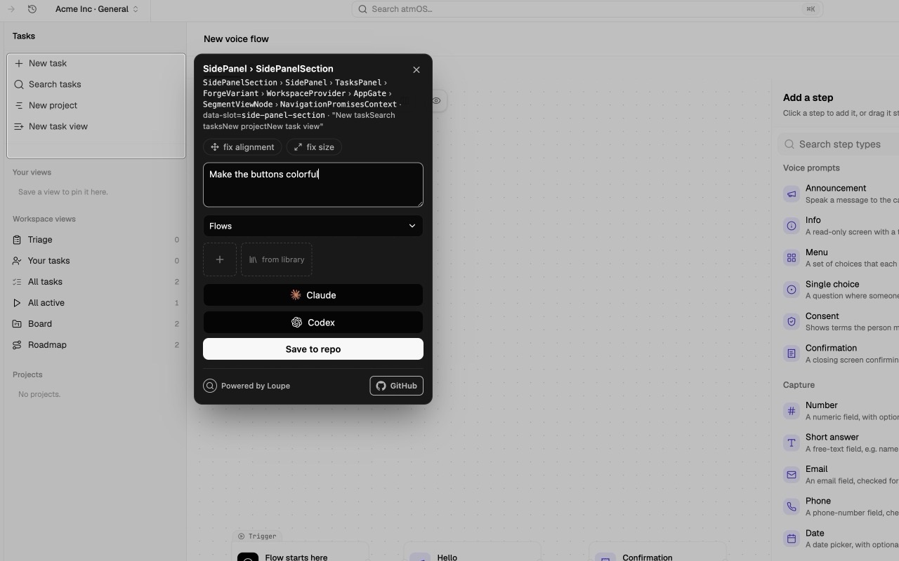

<div align="center">


# Loupe

### point at the UI. say what's wrong. hand it to an agent.

Drag-select any region of a running app, Loupe figures out **which component**
it is, you attach a note (or a reference screenshot), and it's handed straight
to a coding agent — or saved as a committable annotation your teammates pull
from git.

No more "screenshot → paste into chat → hope the agent finds the file."

[](./LICENSE)
[](#getting-started)
[](#how-it-works)
[](#actions)



</div>

---

```
   you, looking at a janky button                    a coding agent, 3 seconds later
            │                                                    ▲
            │ Alt+A, drag a box                                  │ "fixed the padding,
            ▼                                                    │  see comments.jsonl"
   ┌─────────────────────┐    POST    ┌──────────────────────┐   │
   │  Loupe overlay      │ ─────────▶ │  bridge daemon       │ ──┘
   │  • which component? │            │  • writes .loupe/…   │
   │  • note + refs      │            │  • resolves source   │
   │  • pick an action   │            │  • spawns the agent  │
   └─────────────────────┘            └──────────────────────┘
                                                 │
                                      commit .loupe/  ──▶  teammates pull it
```

## Getting Started

Install the CLI and bridge from npm:

```sh
npm install -g @woddlepad/loupe
loupe install-skill
```

`loupe install-skill` installs the Codex `loupe` skill and the Claude Code
`/loupe` slash command, so both agents know how to pick up saved annotations.
If npm returns `404` before the first public release, use the source build path
below.

Install the browser extension:

1. Open the Loupe listing in the Chrome Web Store.
2. Click **Add to Chrome** and approve the extension permissions.
3. Pin Loupe in the browser toolbar if you want the popup close at hand.

The default bridge URL is `http://localhost:7337`, which is what the extension
uses out of the box. If the Web Store listing is not live yet, use the latest
release zip or build from source using the developer instructions below.

Initialize each target repo once:

```sh
cd ~/dev/my-app
loupe init
loupe bridge
```

`loupe init` detects common app stacks
(Next.js, Vite React, Vue, Nuxt, SvelteKit, Angular, Create React App), writes
`.loupe/config.json`, and registers likely local origins in
`~/.loupe/projects.json`. `loupe bridge` runs the local daemon that receives
captures from the extension.

For nonstandard dev servers, pass explicit origins or ports:

```sh
loupe init --origin staging.acme.com --port 5174
```

If multiple projects reuse the same origin, such as `localhost:5173`, use the
project dropdown in the Loupe popup to pick where annotations save. Leave it on
`Auto` for normal URL-based routing. Then press `Alt+A` to capture feedback and
`Alt+Shift+A` to review annotations.

Pick an action after capture:

- **Save to repo** writes the annotation bundle under `.loupe/`.
- **Claude** saves the bundle, then launches Claude Code in the background with
  `claude --permission-mode auto --bg "/loupe <id>"`.
- **Codex** saves the bundle, then opens a Codex Desktop thread with
  `/loupe <id>` and the repo path prefilled.

Pick up and implement annotations from any coding agent:

```sh
cd ~/dev/atmOS
loupe list
loupe show notes
loupe show dde8f08a
```

In Claude Code, use the installed slash command:

```text
/loupe notes
/loupe dde8f08a
```

In Codex, ask for the installed skill:

```text
Use $loupe to implement notes
Use $loupe to implement dde8f08a
```

When an agent finishes, it should move each annotation to review:

```sh
loupe comment dde8f08a --status needs_review --author agent:codex --body "Implemented: aligned shortcut keys. Checks: pnpm test."
```

## Why

The usual UI-feedback loop is lossy: you spot something off, screenshot it, paste
it into a chat, then recall the component name or make the agent go hunting.
Loupe captures **what component it is** at selection time and resolves it to a
source file, so whoever picks it up — a person or an agent — starts with the
answer instead of searching for it. The output is **code-grade context**, not a
vague vibe.

## Features

- 🎯 **Component-aware selection** — drag a box; Loupe walks the React fiber tree
  to name the component (`TaskCard › Button`), the same way React DevTools does.
  Framework-agnostic core, great React support today.
- 🤖 **Hand it to Claude or Codex** — one click routes the screenshot, note, and
  resolved source to **Claude Code** (`claude --permission-mode auto --bg "/loupe <id>"`) or
  **Codex** (`codex://new?prompt=/loupe...`). Codex opens a visible app thread
  by default; set `LOUPE_CODEX_CLOUD_ENV` to submit phone-visible Codex Cloud
  tasks instead.
- 🧩 **Pluggable actions** — `save`, agents, a built-in **Linear** integration,
  and drop-in `.loupe/actions/*.mjs` custom actions ("send it to *my* tracker").
- 🗂️ **Groups** — batch annotations (e.g. *notes UI refactor*) and dispatch the
  whole set to one agent session, no cross-contamination.
- 💬 **Comment threads** — annotations are files, so the agent comments back
  ("implemented, needs review") and you see it in the overlay. You can comment
  feedback or resolve the item yourself.
- 🖼️ **Reference images** — paste a screenshot (e.g. from Notion) to say "make it
  look like *this*."
- 🌐 **Cross-site references** — annotate *any* site. On a non-project origin
  Loupe saves a free-floating reference to a shared library; pull it into a real
  annotation later instead of copy-pasting. Project origins include remote hosts
  (your Tailscale tailnet, staging domains) — not just localhost.
- 📌 **Live viewer** — a panel + numbered page pins showing every
  annotation that needs review, plus this-page and all-pages views with its
  thread, editable note, reference attachments, and a reply box (`Alt+Shift+A`).
  Resolved annotations are hidden by default and can be shown or bulk-deleted
  from the viewer.
- 📦 **Committable** — everything lands in `.loupe/` as `png` + `md` + `json`.
  Commit it; teammates pull the open work.

## How it works

Three small pieces, clean responsibilities:

| Piece | What it is | Where |
| --- | --- | --- |
| **`@loupe/core`** | framework-agnostic overlay: selection, React fiber identification, style-heuristic suggestions, the data model | `packages/core` |
| **`@loupe/extension`** | the MV3 Chrome extension — the *generic* shell that runs on any page, captures true-pixel screenshots, and talks to the daemon | `packages/extension` |
| **`@loupe/bridge`** | a tiny local daemon you run **inside your repo** — resolves components to files, writes the bundle, runs actions | `apps/bridge` |

All repo-specific knowledge lives in the daemon (which runs in your repo's cwd),
so the extension stays generic enough to run on any site — including a teammate's
deployed app.

## Build From Source

```sh
git clone https://github.com/woddlepad/loupe && cd loupe
pnpm install
pnpm build:extension          # → packages/extension/dist
pnpm install:cli              # → ~/.local/bin/loupe and loupe-bridge
pnpm install:skill            # → ~/.codex/skills/loupe and ~/.claude/commands/loupe.md
```

1. **Load the extension:** `chrome://extensions` → enable *Developer mode* →
   *Load unpacked* → select `packages/extension/dist`.
2. **Initialize and start the daemon** from your target repo:
   ```sh
   cd ~/code/my-app
   loupe init
   loupe bridge
   ```
3. **Open your app**, press **`Alt+A`**, drag a region, write a note, pick an
   action. Press **`Alt+Shift+A`** to view annotations + comments. You can
   change or clear both shortcuts from Loupe settings via Chrome's extension
   shortcut editor.

## The annotation bundle

Everything is written into your repo under `.loupe/`, meant to be committed:

```
.loupe/
  annotations/
    notes-ui-refactor/                # ← group
      2026-06-21-a1b2/
        shot.png                      # cropped screenshot
        note.md                       # human + agent readable
        meta.json                     # component, source, rect, suggestions
        comments.jsonl                # append-only thread (agent closes the loop)
        refs/ref-1.png                # reference images
  references/                         # cross-site captures (e.g. Notion)
```

## CLI

Loupe ships a small CLI for humans and agents:

```sh
loupe bridge [--repo <path>] [--port 7337] [--host 127.0.0.1]
loupe init [--repo <path>] [--name <name>] [--origin <host[:port]>] [--port <port>]
loupe list [--repo <path>] [--json]
loupe show <group|annotation_id> [--repo <path>] [--json]
loupe comment <annotation_id> --body "Implemented..." --status needs_review [--repo <path>]
```

Run `loupe init` from a project root to auto-map the repo. It merges
`.loupe/config.json` and `~/.loupe/projects.json` instead of overwriting your
existing action/agent config.

Run one bridge for your registered projects. The bridge writes annotations into
the matching repo's `.loupe/` directory:

```sh
loupe bridge
```

If several registered repos claim the same origin, pick the active project in
the extension popup before annotating. Agents do not need the bridge running to
pick up work: they can use `loupe list` and `loupe show notes` from the repo
root.

For remote debugging over Tailscale:

```sh
# On the target machine where the repo and agents are installed:
loupe bridge --repo ~/dev/atmOS --host 0.0.0.0 --port 7337

# In the extension settings on your browser machine:
http://danis-mbp.tail123.ts.net:7337
```

Keep this on a private network. The bridge accepts annotation writes and can
launch configured local agent commands on the target machine.

## Actions

The note panel renders one button per action the daemon advertises. Configure in
`.loupe/config.json`:

```json
{
  "agents": {
    "claude": { "mode": "spawn", "argv": ["claude", "--permission-mode", "auto", "--bg", "{loupeCommand}"] },
    "codex": { "mode": "codex-app" }
  },
  "integrations": {
    "linear": { "apiKey": "lin_api_…", "teamId": "…" }
  }
}
```

Agents run in one of four modes:

- **`spawn`** — launch a fresh detached process from `argv`. Placeholders:
  `{prompt}`, `{imageArgs}` (→ `-i shot.png,ref.png` for Codex), `{bundleDir}`,
  `{screenshot}`, `{loupeCommand}` (→ `/loupe <id-or-group>`), `{codexUrl}`,
  and `{repoRoot}`.
- **`codex-app`** — open a visible Codex Desktop thread with `/loupe <id-or-group>`
  and the repo path prefilled. Codex uses this by default when
  `LOUPE_CODEX_CLOUD_ENV` is not set.
- **`codex-app-server`** — create a visible Codex Desktop thread through the
  Codex app-server daemon on the bridge machine. Use this for remote bridges
  where your local Codex app is connected to the target host over SSH.
- **`session`** — don't spawn anything. The annotation is committed to
  `.loupe/`, so an already-open agent session or custom workflow can pick it up.

For a remote bridge that should hand annotations to the Codex desktop app
connected to that same host, start the bridge with:

```sh
LOUPE_CODEX_APP_SERVER=1 loupe bridge --repo ~/dev/atmOS --host 0.0.0.0
```

Or make the daemon socket explicit in `.loupe/config.json`:

```json
{
  "agents": {
    "codex": {
      "mode": "codex-app-server",
      "socketPath": "/root/.codex/app-server-control/app-server-control.sock"
    }
  }
}
```

To submit phone-visible Codex Cloud tasks, configure a Codex Cloud environment
and start the bridge with:

```sh
LOUPE_CODEX_CLOUD_ENV=env_abc123 loupe bridge --repo ~/dev/atmOS
```

Or make it explicit in `.loupe/config.json`:

```json
{
  "agents": {
    "codex": { "mode": "spawn", "argv": ["codex", "cloud", "exec", "--env", "env_abc123", "{loupeCommand}"] }
  }
}
```

Cloud tasks can only read files that exist in the GitHub checkout for that
environment, so commit/push `.loupe/` annotations when the screenshot bundle
needs to be available in Cloud.

Custom action — drop a file in and a button appears:

```js
// .loupe/actions/jira.mjs
export default {
  id: "jira",
  label: "create Jira issue",
  async run({ annotation, bundle, resolution, config }) {
    // …call your tracker
    return { ok: true, detail: "created PROJ-42", url: "https://…" };
  },
};
```

See [Custom Actions](./docs/custom-actions.md) for the full action/hook syntax,
context object, return values, webhook examples, and agent examples.

## Roadmap

- [ ] teammate overlay sync (live, not just git)
- [ ] Vue / Svelte fiber adapters
- [ ] optional build plugin for exact `file:line` source mapping

## Develop

```sh
pnpm -r type-check
pnpm -r test
pnpm --filter @loupe/extension dev   # esbuild + tailwind watch
```

## Distribute

Run the full release preflight:

```sh
pnpm release:check
pnpm store:assets
pnpm pack:npm
```

Create just the Chrome Web Store-ready zip:

```sh
pnpm package:extension
```

The artifact is written to `artifacts/loupe-extension-v<version>.zip`. Upload
that zip in the Chrome Web Store Developer Dashboard. For local QA before
uploading, load `packages/extension/dist` from `chrome://extensions`.

See [Distribution](./docs/distribution.md) for npm publish commands, Chrome Web
Store listing copy, permission justifications, privacy answers, store images,
and the README link update once Chrome assigns the extension ID.

## License

[MIT](./LICENSE) © 2026 Daniel Teigland
