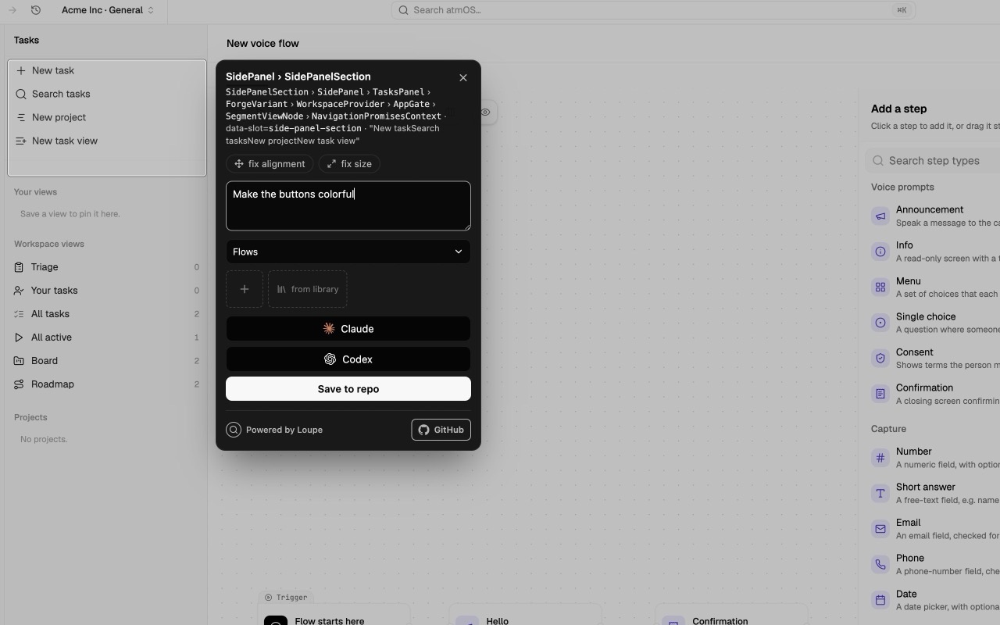

<div align="center">


# Loupe

### point at the UI. say what's wrong. hand it to an agent.

Drag-select any region of a running app, Loupe figures out **which component**
it is, you attach a note (or a reference screenshot), and it's handed straight
to a coding agent — or saved as a committable annotation your teammates pull
from git.

No more "screenshot → paste into chat → hope the agent finds the file."

[](./LICENSE)
[](#getting-started)
[](#how-it-works)
[](#actions)



</div>

---

```
   you, looking at a janky button                    a coding agent, 3 seconds later
            │                                                    ▲
            │ Alt+A, drag a box                                  │ "fixed the padding,
            ▼                                                    │  marked needs_review"
   ┌─────────────────────┐    POST    ┌──────────────────────┐   │
   │  Loupe overlay      │ ─────────▶ │  bridge daemon       │ ──┘
   │  • which component? │            │  • writes .loupe/…   │
   │  • note + refs      │            │  • resolves source   │
   │  • pick an action   │            │  • spawns the agent  │
   └─────────────────────┘            └──────────────────────┘
                                                 │
                                      commit .loupe/  ──▶  teammates pull it
```

## Getting Started

Install from source:

```sh
git clone https://github.com/woddlepad/loupe
cd loupe
pnpm install
```

`pnpm install` rebuilds Loupe, installs the `loupe` and `loupe-bridge` CLI
shims, installs the Codex `loupe` and `dream` skills, installs the Claude Code
`/loupe` and `/dream` slash commands, and prepares the Chrome extension from
`packages/extension/dist`.

Chrome requires one manual approval the first time a source-built unpacked
extension is loaded:

1. Open `chrome://extensions`.
2. Enable **Developer mode**.
3. Click **Load unpacked** and select `packages/extension/dist`.
3. Pin Loupe in the browser toolbar if you want the popup close at hand.

After that first load, future updates are just:

```sh
git pull
pnpm install
```

The install hook rebuilds the extension and reloads it in Chrome automatically
when it finds Loupe already loaded from `packages/extension/dist`. If Chrome is
not available or the extension was loaded before the reload hook existed, the
install remains successful and prints the manual reload step.

The default bridge URL is `http://localhost:7337`, which is what the extension
uses out of the box.

Initialize each target repo once:

```sh
cd ~/dev/my-app
loupe init
loupe bridge
```

`loupe init` detects common app stacks
(Next.js, Vite React, Vue, Nuxt, SvelteKit, Angular, Create React App), writes
`.loupe/config.json`, and registers likely local origins in
`~/.loupe/projects.json`. `loupe bridge` runs the local daemon that receives
captures from the extension.

For nonstandard dev servers, pass explicit origins or ports:

```sh
loupe init --origin staging.acme.com --port 5174
```

If multiple projects reuse the same origin, such as `localhost:5173`, use the
project dropdown in the Loupe popup to pick where annotations save. Leave it on
`Auto` for normal URL-based routing. Then press `Alt+A` to capture feedback and
`Alt+Shift+A` to review annotations.

Pick an action after capture:

- **Save to repo** writes the annotation bundle under `.loupe/`.
- **Claude** saves the bundle, then launches Claude Code in the background with
  `claude --permission-mode auto --bg "/loupe <id>"`.
- **Codex** saves the bundle, then launches Codex in the background with
  `codex exec "/loupe <id>"`. Switch the extension setting to URL handler if
  you want a visible Codex Desktop thread instead.
- **Copilot** saves the bundle, then runs the GitHub Copilot CLI headless with
  `copilot --allow-all-tools -p "<inline prompt>"` (the standalone `copilot`
  binary — `npm i -g @github/copilot` — not the deprecated `gh copilot`).
- **Pi** saves the bundle, then runs the Pi coding agent with
  `pi -p @shot.png "<inline prompt>"`, attaching the screenshot for vision
  (`npm i -g --ignore-scripts @earendil-works/pi-coding-agent`).

The bridge only advertises providers whose CLI is installed, so uninstalled
agents never appear. You can also hide installed providers per-browser from the
extension options page (**Providers**).

Pick up and implement annotations from any coding agent:

```sh
cd ~/dev/atmOS
loupe list
loupe show notes
loupe show dde8f08a
```

In Claude Code, use the installed slash command:

```text
/loupe notes
/loupe dde8f08a
```

In Codex, ask for the installed skill:

```text
Use $loupe to implement notes
Use $loupe to implement dde8f08a
```

When an agent finishes, it should move each annotation to review:

```sh
loupe status dde8f08a --status needs_review --author agent:codex
```

Open Dreamer when you want to plan and launch larger work:

```sh
loupe dreamer
open "$(loupe dreamer)"
```

Dreamer reads implementation plans from `.loupe/dreams/`. Create one from
Claude Code with `/dream <goal>` or from Codex by asking it to use `$dream`.

## Why

The usual UI-feedback loop is lossy: you spot something off, screenshot it, paste
it into a chat, then recall the component name or make the agent go hunting.
Loupe captures **what component it is** at selection time and resolves it to a
source file, so whoever picks it up — a person or an agent — starts with the
answer instead of searching for it. The output is **code-grade context**, not a
vague vibe.

## Features

- 🎯 **Component-aware selection** — drag a box; Loupe walks the framework's
  component tree to name the component (`TaskCard › Button`), the same way the
  framework devtools do. First-class **React** and **Vue / Vuetify** support
  today, with a framework-agnostic fallback for everything else — see the
  [framework support matrix](./docs/framework-support.md).
- 🤖 **Hand it to Claude or Codex** — one click routes the screenshot, note, and
  resolved source to **Claude Code** (`claude --permission-mode auto --bg "/loupe <id>"`) or
  **Codex** (`codex exec "/loupe <id>"`). Codex runs in the background by
  default; set `LOUPE_CODEX_CLOUD_ENV` to submit phone-visible Codex Cloud tasks,
  or switch the extension setting to URL handler for a visible app thread.
- 🧩 **Pluggable actions** — `save`, agents, a built-in **Linear** integration,
  and drop-in `.loupe/actions/*.mjs` custom actions ("send it to *my* tracker").
- 🗂️ **Groups** — batch annotations (e.g. *notes UI refactor*) and dispatch the
  whole set to one agent session, no cross-contamination.
- 🌙 **Dreamer plans** — turn larger goals into visual implementation plans under
  `.loupe/dreams/`, review or edit them in the bridge UI, and launch an
  overnight agent run with the right repo, branch, artifacts, and report path.
- ✅ **Review workflow** — annotations are files with a lifecycle status. The
  agent moves each one to *needs review* when it's implemented, and you resolve
  (or reopen) it from the overlay.
- 🖼️ **Reference images** — paste a screenshot (e.g. from Notion) to say "make it
  look like *this*."
- 🌐 **Cross-site references** — annotate *any* site. On a non-project origin
  Loupe saves a free-floating reference to a shared library; pull it into a real
  annotation later instead of copy-pasting. Project origins include remote hosts
  (your Tailscale tailnet, staging domains) — not just localhost.
- 📌 **Live viewer** — a panel + numbered page pins showing every
  annotation that needs review, plus this-page and all-pages views with its
  thread, editable note, reference attachments, and a reply box (`Alt+Shift+A`).
  Resolved annotations are hidden by default and can be shown or bulk-deleted
  from the viewer.
- 📦 **Committable** — everything lands in `.loupe/` as `png` + `md` + `json`.
  Commit it; teammates pull the open work.

## How it works

Three small pieces, clean responsibilities:

| Piece | What it is | Where |
| --- | --- | --- |
| **`@loupe/core`** | framework-agnostic overlay: selection, React/Vue component identification, style-heuristic suggestions, the data model | `packages/core` |
| **`@loupe/extension`** | the MV3 Chrome extension — the *generic* shell that runs on any page, captures true-pixel screenshots, and talks to the daemon | `packages/extension` |
| **`@loupe/bridge`** | a tiny local daemon you run **inside your repo** — resolves components to files, writes the bundle, runs actions | `apps/bridge` |

All repo-specific knowledge lives in the daemon (which runs in your repo's cwd),
so the extension stays generic enough to run on any site — including a teammate's
deployed app.

## Source Install

```sh
pnpm install
```

This is the main install path while the Chrome Web Store listing is unpublished.
It runs `pnpm build`, installs local CLI shims, installs the Codex skills and
Claude commands, and handles the Chrome extension setup.

On macOS and Linux the CLI shims are written to `~/.local/bin`. On Windows they
are written to `%LOCALAPPDATA%\Programs\Loupe\bin`. If that directory is not on
`PATH`, the installer prints a warning.

If you need to rerun the source setup without reinstalling dependencies:

```sh
pnpm install:source
```

If you need to skip the browser step on a headless machine:

```sh
LOUPE_SKIP_CHROME_INSTALL=1 pnpm install
```

CI skips the source install hook by default. Set
`LOUPE_RUN_SOURCE_INSTALL_IN_CI=1` to force the local setup in CI, or
`LOUPE_SKIP_SOURCE_INSTALL=1` to skip it explicitly anywhere.

1. **First-time Chrome approval:** `chrome://extensions` → enable *Developer
   mode* → *Load unpacked* → select `packages/extension/dist`. Future
   `pnpm install` runs reload it automatically.
2. **Initialize and start the daemon** from your target repo:
   ```sh
   cd ~/code/my-app
   loupe init
   loupe bridge
   ```
3. **Open your app**, press **`Alt+A`**, drag a region, write a note, pick an
   action. Press **`Alt+Shift+A`** to view annotations. You can change or clear
   both shortcuts from Loupe settings via Chrome's extension shortcut editor.

## The annotation bundle

Everything is written into your repo under `.loupe/`, meant to be committed:

```
.loupe/
  annotations/
    notes-ui-refactor/                # ← group
      2026-06-21-a1b2/
        shot.png                      # cropped screenshot
        note.md                       # human + agent readable
        meta.json                     # component, source, rect, status, suggestions
        refs/ref-1.png                # reference images
  references/                         # cross-site captures (e.g. Notion)
  dreams/
    keyboard-shortcuts/
      dream.json                      # title, goal, status, priority, branch
      plan.mdx                        # implementation plan
      canvas.mdx                      # optional diagrams / flow maps
      prototype.mdx                   # optional UI sketch
      prototype.html                  # optional iframe-rendered prototype
      report.md                       # agent-written implementation report
```

## CLI

Loupe ships a small CLI for humans and agents:

```sh
loupe bridge [--repo <path>] [--port 7337] [--host 127.0.0.1]
loupe init [--repo <path>] [--name <name>] [--origin <host[:port]>] [--port <port>]
loupe list [--repo <path>] [--json]
loupe dreams [--repo <path>] [--json]
loupe dream <dream_id> [--repo <path>] [--json]
loupe dreamer [--repo <path>] [--port 7337] [--host 127.0.0.1]
loupe show <group|annotation_id> [--repo <path>] [--json]
loupe status <annotation_id> --status needs_review [--author agent:codex] [--repo <path>]
```

Run `loupe init` from a project root to auto-map the repo. It merges
`.loupe/config.json` and `~/.loupe/projects.json` instead of overwriting your
existing action/agent config.

Run one bridge for your registered projects. The bridge writes annotations into
the matching repo's `.loupe/` directory:

```sh
loupe bridge
```

If several registered repos claim the same origin, pick the active project in
the extension popup before annotating. Agents do not need the bridge running to
pick up work: they can use `loupe list` and `loupe show notes` from the repo
root.

For remote debugging over Tailscale:

```sh
# On the target machine where the repo and agents are installed:
loupe bridge --repo ~/dev/atmOS --host 0.0.0.0 --port 7337

# In the extension settings on your browser machine:
http://danis-mbp.tail123.ts.net:7337
```

Keep this on a private network. The bridge accepts annotation writes and can
launch configured local agent commands on the target machine.

## Dreamer

Dreamer is Loupe's planning surface for larger changes that should be reviewed
before an agent starts implementing. It is served by the same bridge at
`/dreamer` and stores every plan in the target repo, so plans and reports can be
committed, reviewed, and resumed like annotations.

Create a plan from Claude Code:

```text
/dream add keyboard shortcuts to the billing table
```

Or in Codex:

```text
Use $dream to plan keyboard shortcuts for the billing table
```

The Dream skill researches the repo and writes a read-only artifact under
`.loupe/dreams/<id>/`:

```text
.loupe/dreams/<id>/
  dream.json       # title, goal, status, priority, branch, timestamps
  plan.mdx         # repo findings, behavior, implementation steps, verification
  canvas.mdx       # optional journey maps, diagrams, or data-flow notes
  prototype.mdx    # optional UI or interaction sketch
  prototype.html   # optional iframe-rendered prototype
  report.md        # written by the implementing agent
```

Open the Dreamer UI with:

```sh
loupe dreamer
```

While `loupe bridge` is running, Dreamer lets you:

- review plans sorted by recommendation, priority, branch, or title
- create or edit plan metadata and markdown directly in the browser
- view MDX plans, Mermaid diagrams, images, prototypes, and implementation reports
- launch any installed agent provider against a plan, including model selection
- copy the exact launch prompt, reset a running plan, or delete stale plans

Launching a plan sends the agent a `/goal` prompt that tells it to implement the
saved Dreamer plan with `ship-feature`, read the plan and visual artifacts as
source of truth, and write the final implementation report back to
`.loupe/dreams/<id>/report.md`.

## Actions

The note panel renders one button per action the daemon advertises. Configure in
`.loupe/config.json`:

```json
{
  "agents": {
    "claude": { "mode": "spawn", "argv": ["claude", "--permission-mode", "auto", "--bg", "{loupeCommand}"] },
    "codex": { "mode": "spawn", "argv": ["codex", "exec", "{loupeCommand}"] },
    "copilot": { "mode": "spawn", "argv": ["copilot", "--allow-all-tools", "-p", "{prompt}"] },
    "pi": { "mode": "spawn", "argv": ["pi", "-p", "{atImages}", "{prompt}"] }
  },
  "integrations": {
    "linear": { "apiKey": "lin_api_…", "teamId": "…" }
  }
}
```

Agents run in one of four modes:

- **`spawn`** — launch a fresh detached process from `argv`, advertised only
  when `argv[0]` is on `PATH`. Placeholders:
  `{prompt}`, `{imageArgs}` (→ `-i shot.png,ref.png` for Codex),
  `{atImages}` (→ `@shot.png @ref.png` for Pi), `{bundleDir}`,
  `{screenshot}`, `{loupeCommand}` (→ `/loupe <id-or-group>`), `{codexUrl}`,
  and `{repoRoot}`.
- **`codex-app`** — open a visible Codex Desktop thread with `/loupe <id-or-group>`
  and the repo path prefilled. You can choose this from the extension settings
  when you prefer URL-handler handoff.
- **`codex-app-server`** — create a visible Codex Desktop thread through the
  Codex app-server daemon on the bridge machine. Use this for remote bridges
  where your local Codex app is connected to the target host over SSH.
- **`session`** — don't spawn anything. The annotation is committed to
  `.loupe/`, so an already-open agent session or custom workflow can pick it up.

The built-in Codex background action automatically uses `codex-app-server`
when the default Codex app-server socket exists at
`$CODEX_HOME/app-server-control/app-server-control.sock` (or `~/.codex/...`).
That makes background handoffs appear in Codex Desktop. If the socket is not
available, Loupe falls back to `codex exec`.

For a remote bridge, or to force app-server mode before the socket exists,
start the bridge with:

```sh
LOUPE_CODEX_APP_SERVER=1 loupe bridge --repo ~/dev/atmOS --host 0.0.0.0
```

Or make the daemon socket explicit in `.loupe/config.json`:

```json
{
  "agents": {
    "codex": {
      "mode": "codex-app-server",
      "socketPath": "/root/.codex/app-server-control/app-server-control.sock"
    }
  }
}
```

To submit phone-visible Codex Cloud tasks, configure a Codex Cloud environment
and start the bridge with:

```sh
LOUPE_CODEX_CLOUD_ENV=env_abc123 loupe bridge --repo ~/dev/atmOS
```

Or make it explicit in `.loupe/config.json`:

```json
{
  "agents": {
    "codex": { "mode": "spawn", "argv": ["codex", "cloud", "exec", "--env", "env_abc123", "{loupeCommand}"] }
  }
}
```

Cloud tasks can only read files that exist in the GitHub checkout for that
environment, so commit/push `.loupe/` annotations when the screenshot bundle
needs to be available in Cloud.

Custom action — drop a file in and a button appears:

```js
// .loupe/actions/jira.mjs
export default {
  id: "jira",
  label: "create Jira issue",
  async run({ annotation, bundle, resolution, config }) {
    // …call your tracker
    return { ok: true, detail: "created PROJ-42", url: "https://…" };
  },
};
```

See [Custom Actions](./docs/custom-actions.md) for the full action/hook syntax,
context object, return values, webhook examples, and agent examples.

### Headless Storybook screenshots

Capture a deterministic PNG from a running Storybook using its direct story
iframe:

```sh
loupe story shot foundations-actions-button--primary
loupe story shot <annotation-id> --selector '.button-preview' --output /tmp/button.png
loupe story open foundations-actions-button--primary --url http://localhost:6206
```

For an annotation with captured Storybook metadata, Loupe uses its story ID and
writes `story.png` beside the annotation bundle. Raw story IDs write to
`.loupe/shots/`. The Storybook URL is resolved from `--url`, annotation
metadata, `LOUPE_STORYBOOK_URL`, `.loupe/config.json`, then
`http://localhost:6006`. Configure a repo with either a URL string or object:

```json
{ "storybook": { "url": "http://localhost:6006" } }
```

If Chromium is not installed yet, run `pnpm exec playwright install chromium`.

## Roadmap

- [ ] teammate overlay sync (live, not just git)
- [ ] Vue / Svelte fiber adapters
- [ ] optional build plugin for exact `file:line` source mapping

## Develop

```sh
pnpm -r type-check
pnpm -r test
pnpm --filter @loupe/extension dev   # esbuild + tailwind watch
```

## Distribute

Run the full release preflight:

```sh
pnpm release:check
pnpm store:assets
pnpm pack:npm
```

Create just the Chrome Web Store-ready zip:

```sh
pnpm package:extension
```

The artifact is written to `artifacts/loupe-extension-v<version>.zip`. Upload
that zip in the Chrome Web Store Developer Dashboard. For local QA before
uploading, load `packages/extension/dist` from `chrome://extensions`.

See [Distribution](./docs/distribution.md) for npm publish commands, Chrome Web
Store listing copy, permission justifications, privacy answers, store images,
and the README link update once Chrome assigns the extension ID.

## License

[MIT](./LICENSE) © 2026 Daniel Teigland
